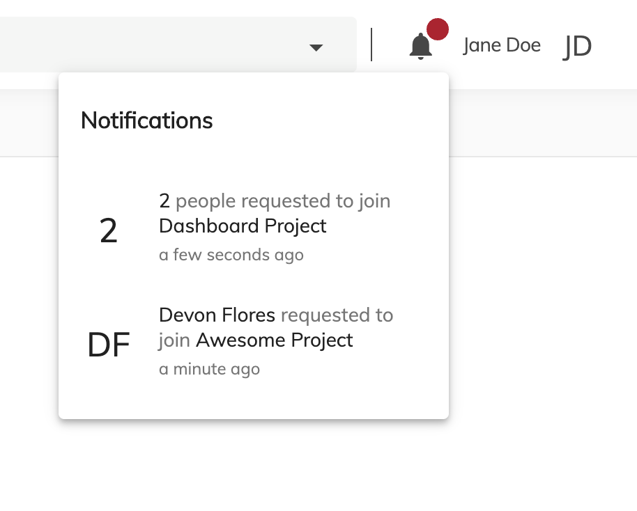

# [Library Notifications Component](../src/lib/components/library-notifications/library-notifications.component.ts)

Displays requests to join a library



## Basic Usage

```html
<acs-membership-requests-notifications>
</acs-membership-requests-notifications>
```

## Details

The frequency of pooling can be configured from `app.config.json` via `notificationsPooling` property. 

```json
{
    "notificationsPooling": 1000000
}
```

If the property is not declared, the defaults is `30000`
