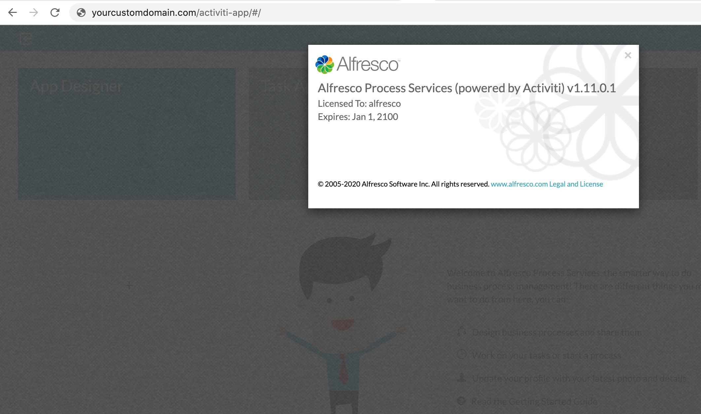
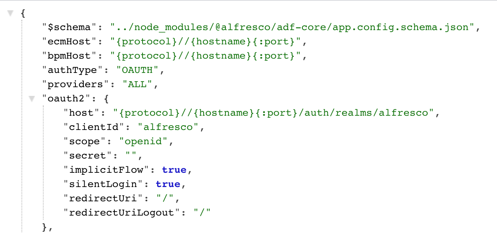
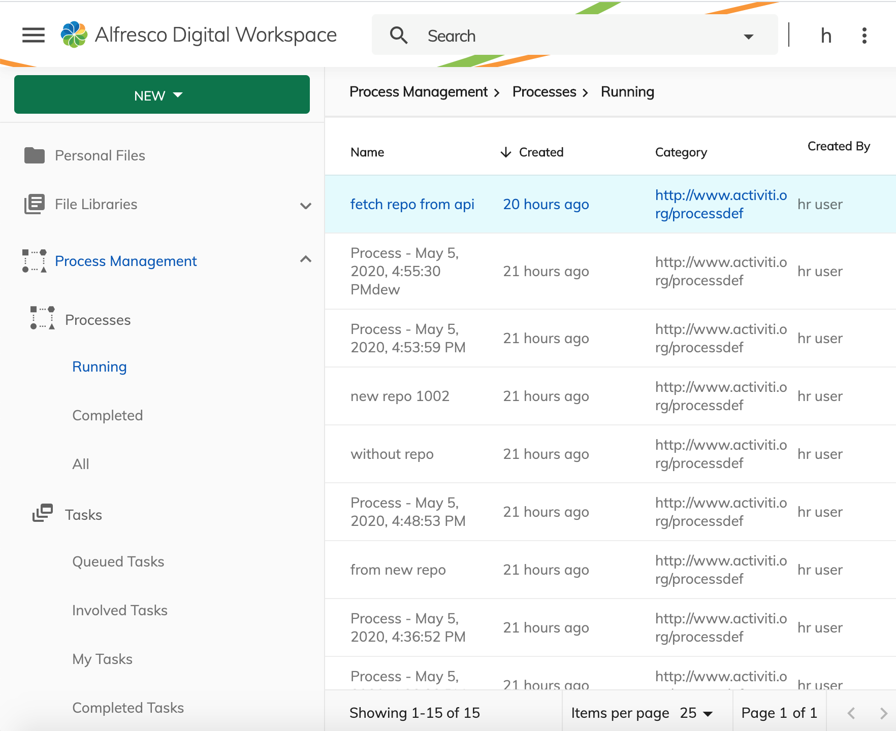
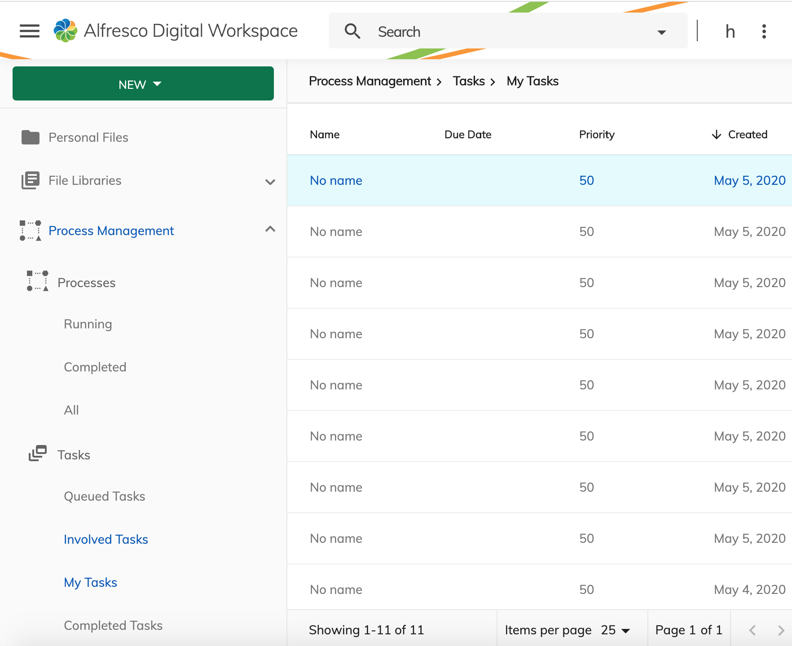
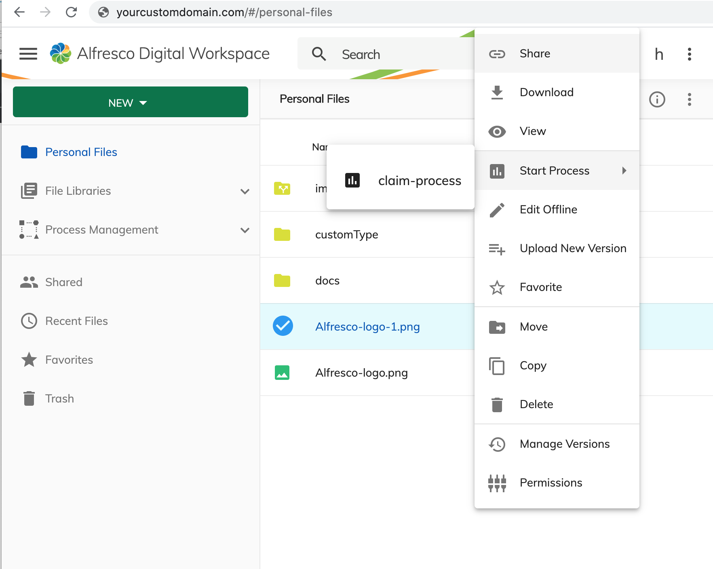

# ADW Process Services Extension

The Process Service plugin allow you to manage the processes/tasks available in activiti

## Prerequisites

- APS 1.11 with identity service running

- ACS 6.2.1 configured with identity service
- ADW configured with identity service


## Enabling the plugin

In the `apps/content-ee/src/app.config.json`, update the `plugins` section:

```json
{
  "plugins": {
    "processService": true
  }
}
```

Once the plugin is enabled, you get the Process Management section on the navigation bar 

**Process List**:



**Task List**:



**Starting a process from a content**:


